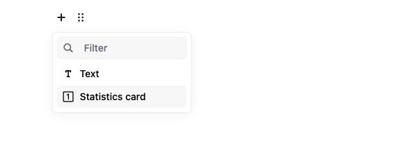
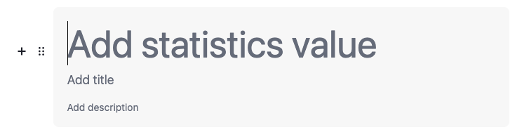

# Card Statistics Tool for Editor.js

Provides Card Statistics blocks for the [Editor.js](https://editorjs.io/).



## Features

- **Value Field**: Add statistical numbers, percentages, or any metric
- **Title Field**: Descriptive labels for your statistics
- **Description Field**: Additional context or details
- **Content Alignment**: Left, center, or right alignment options
- **HTML Support**: All fields support rich text formatting



## Installation

Use your package manager to install the package `editorjs-card-statistics`.

```bash
npm install editorjs-card-statistics

yarn add editorjs-card-statistics
```

## Usage Example

### Basic Setup

```javascript
import EditorJS from "@editorjs/editorjs"
import CardStatistics from "editorjs-card-statistics"

const editor = new EditorJS({
  tools: {
    cardStatistics: CardStatistics,
  },
})
```

### With Custom Configuration

```javascript
const editor = new EditorJS({
  tools: {
    cardStatistics: {
      class: CardStatistics,
      inlineToolbar: ["bold", "italic"],
      config: {
        valuePlaceholder: "Enter statistic value",
        titlePlaceholder: "Add a title",
        descriptionPlaceholder: "Add description",
      },
    },
  },
})
```

### Output Data

```json
{
  "type": "cardStatistics",
  "data": {
    "value": "94%",
    "title": "Customer Satisfaction",
    "description": "Based on 1,200+ reviews",
    "align": "center"
  }
}
```

## Development

This tool uses [Vite](https://vitejs.dev/) as builder.

**Commands**

`npm run dev` — run development environment with hot reload

`npm run build` — build the tool for production to the `dist` folder

## Configuration Options

| Option                   | Type     | Default                  | Description                            |
| ------------------------ | -------- | ------------------------ | -------------------------------------- |
| `valuePlaceholder`       | `string` | `'Add statistics value'` | Placeholder text for value field       |
| `titlePlaceholder`       | `string` | `'Add title'`            | Placeholder text for title field       |
| `descriptionPlaceholder` | `string` | `'Add description'`      | Placeholder text for description field |

## Links

[Editor.js](https://editorjs.io) • [Create Tool](https://github.com/editor-js/create-tool)
